class: chapter-slide
# El entorno de RStudio

<br><br><br><br><br>
```{r,echo=FALSE,out.width='30%',fig.align='right'}
knitr::include_graphics("https://raw.githubusercontent.com/rstudio/hex-stickers/master/PNG/RStudio.png")
```


---
# Instalación

```{r,echo=FALSE,out.width='70%',fig.align='center'}
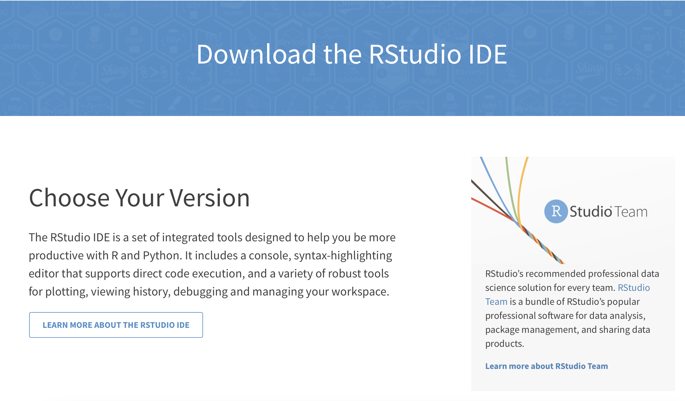
```
.center[<https://www.rstudio.com/products/rstudio/download/>]

---
# Abriendo RStudio

```{r,echo=FALSE,out.width='70%',fig.align='center'}
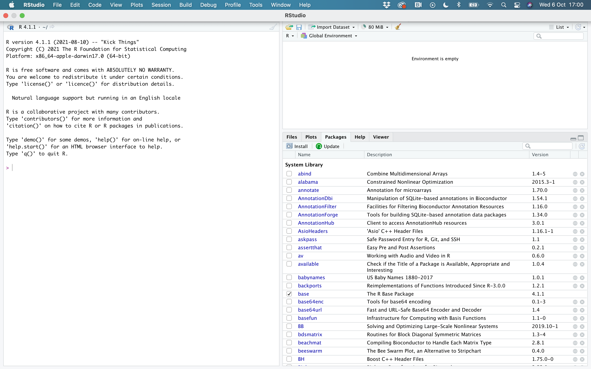
```

---
# El panel Console

Es el lugar donde ejecutamos código directamente.

```{r,echo=FALSE,out.width='60%',fig.align='center'}
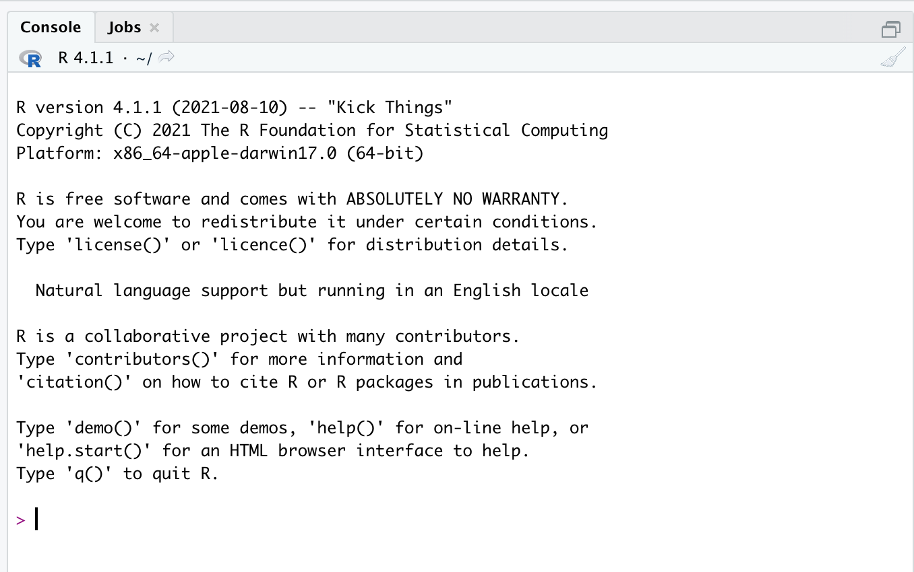
```

---
# El panel de Scripts

Es nuestro 'bloc de notas' donde podemos guardar código, hacer comentarios y ejecutar el código hacia la consola.

```{r,echo=FALSE,out.width='70%',fig.align='center'}
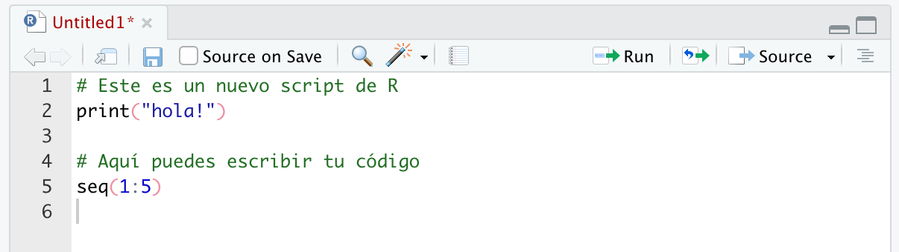
```

---
# La pestaña Environment

Muestra las variables y las funciones que hemos creado y ejecutado durante nuestra sesión.

```{r,echo=FALSE,out.width='70%',fig.align='center'}
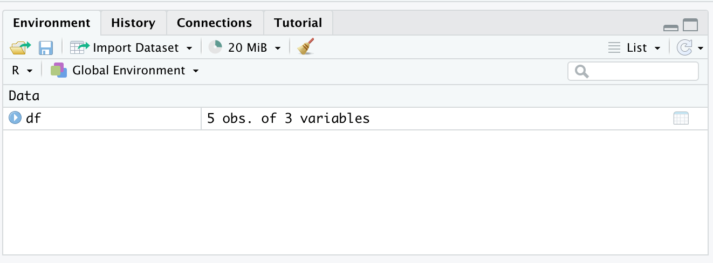
```

---
# La pestaña History

Muestra el historial del código que hemos ejecutado. 

```{r,echo=FALSE,out.width='70%',fig.align='center'}
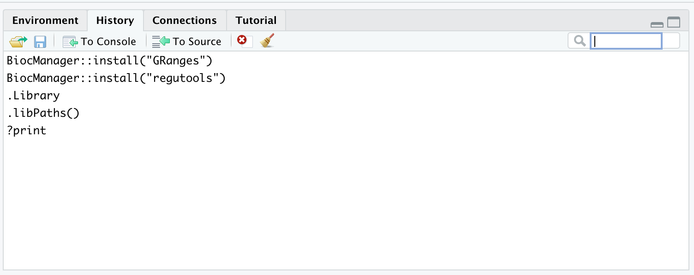
```

---
# La pestaña Files

Muestra los archivos en nuestra computadora, localizados en nuestro directorio de trabajo.

```{r,echo=FALSE,out.width='65%',fig.align='center'}
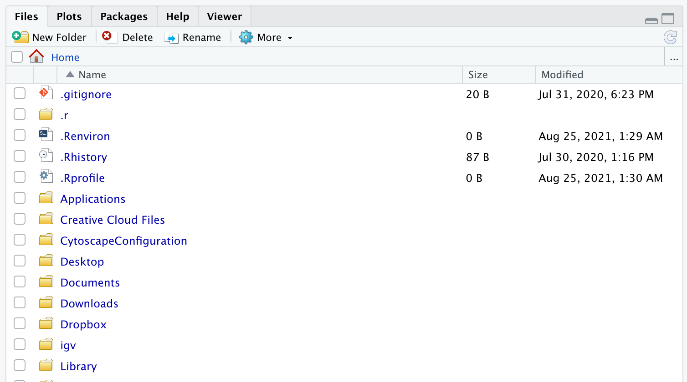
```

---
# La pestaña Plots

Nos muestra las gráficas, resultado de la ejecución de funciones para generar gráficas desde R base o con ayuda de ggplot2.

```{r,echo=FALSE,out.width='50%',fig.align='center'}
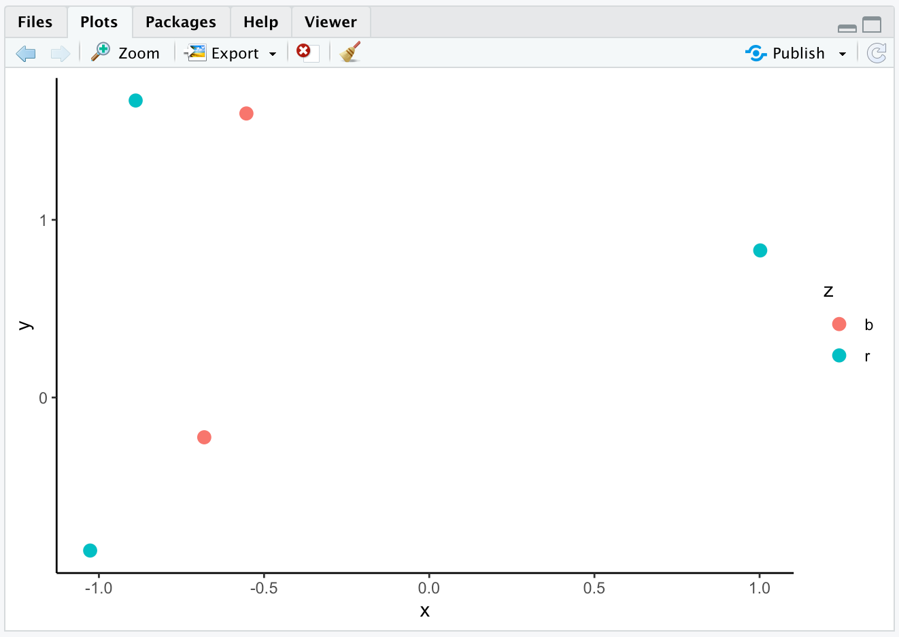
```

---
# La pestaña Packages

Nos muestra los paquetes que tenemos instalados en nuestra computadora.

```{r,echo=FALSE,out.width='68%',fig.align='center'}
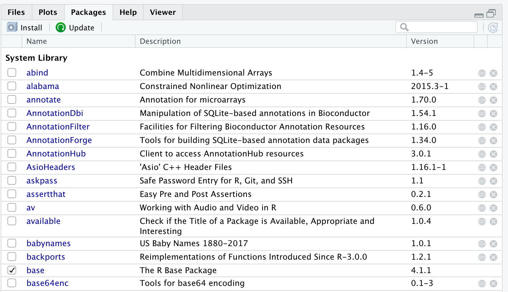
```

---
# La pestaña Help

Nos muestra la documentación de una función; incluye su descripción, funcionamiento, argumentos/parámetros, el tipo de resultados y ejemplos.

```{r,echo=FALSE,out.width='50%',fig.align='center'}
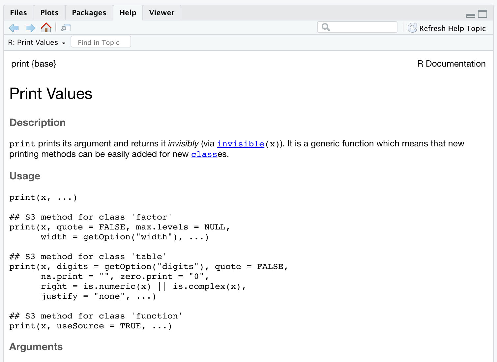
```

---
# La pestaña Viewer

Nos muestra una vista previa de los archivos tipo .Rmd, que generalmente visualizamos como html.

```{r,echo=FALSE,out.width='55%',fig.align='center'}
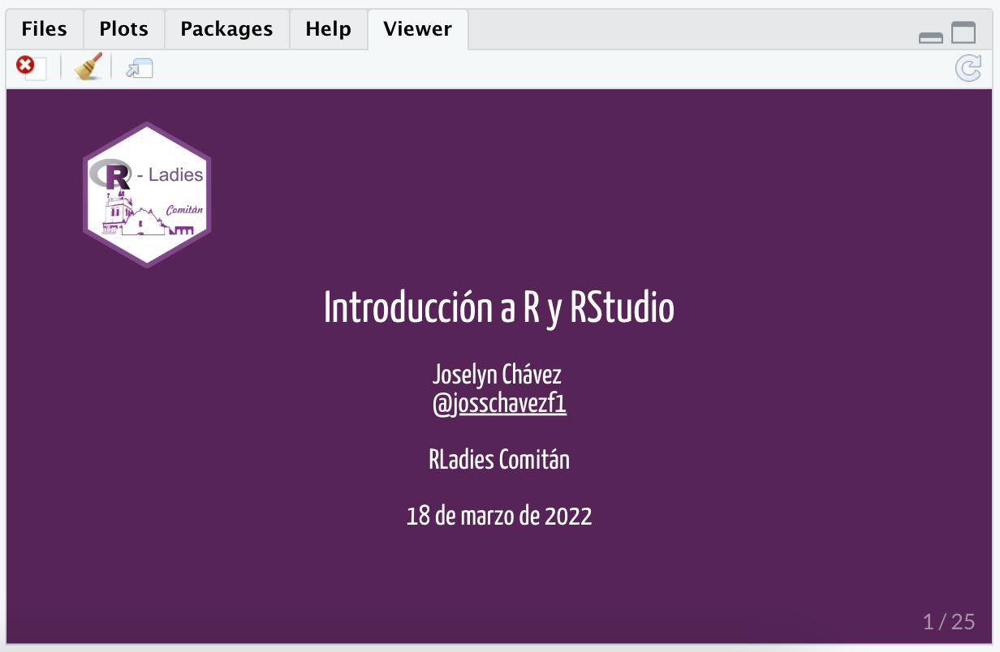
```

---
# Creando otros archivos del entorno de R

.pull-left[<br><br><br>
Podemos crear diversos archivos dentro de R, como .R, .Rmd, .css, .txt, .html, etc.

Estos archivos los podremos editar en el mismo espacio del panel de scripts.
]

.pull-right[
```{r,echo=FALSE,out.width='75%',fig.align='center'}
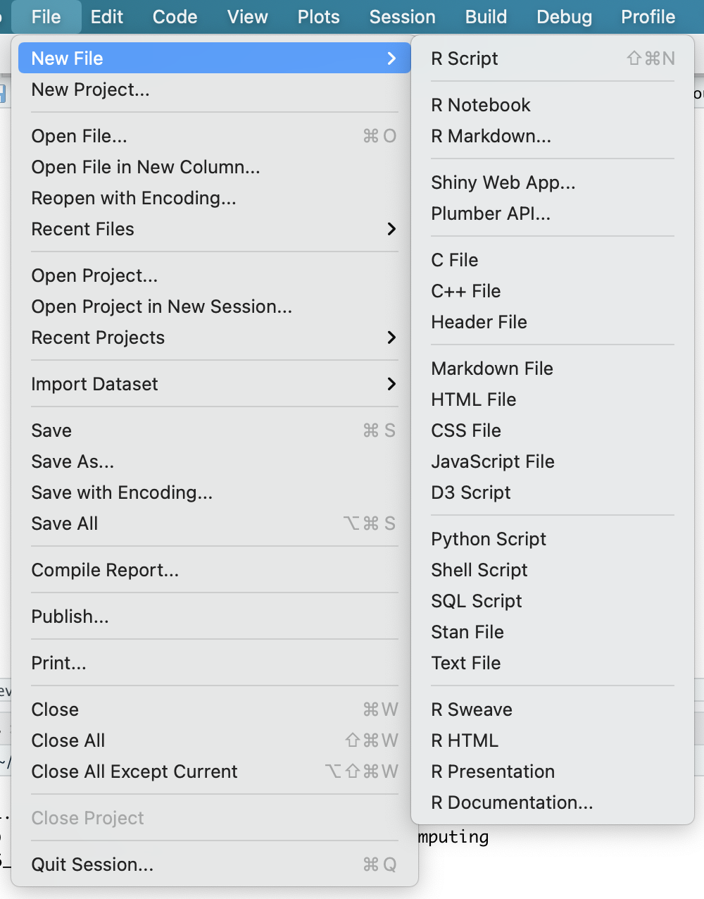
```
]

---
class: chapter-slide

# Algunas configuraciones de RStudio

---
# El archivo .RData

.pull-left[<br><br><br>
Este archivo guarda todas las variables de nuestro Environment y los paquetes cargados durante la sesión.

En general no es recomendable guardarlo, es preferible comenzar desde un entorno limpio.

]

.pull-right[
```{r,echo=FALSE,out.width='93%',fig.align='center'}
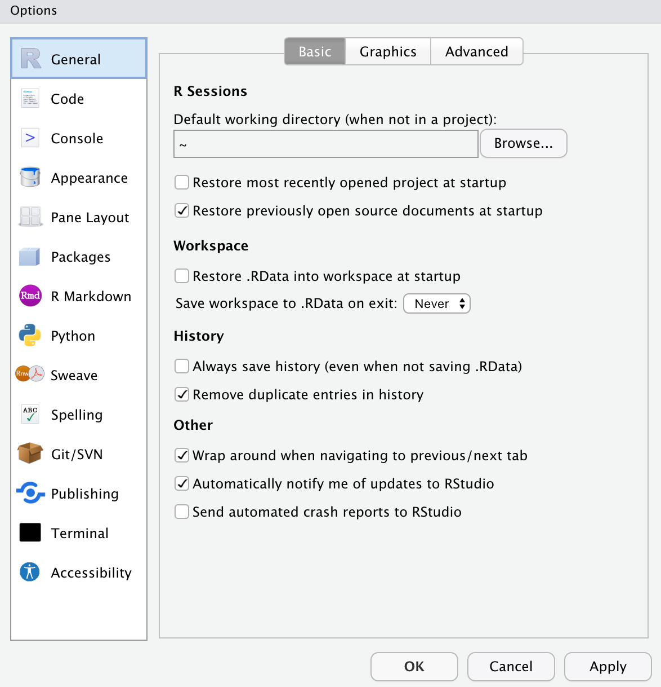
```
]

---
# Paréntesis de arcoíris

.pull-left[<br><br><br>
Nos facilita diferenciar en dónde se abren y cierran los paréntesis.

Es especialmente útil cuando trabajamos con código anidado.
]

.pull-right[
```{r,echo=FALSE,out.width='93%',fig.align='center'}
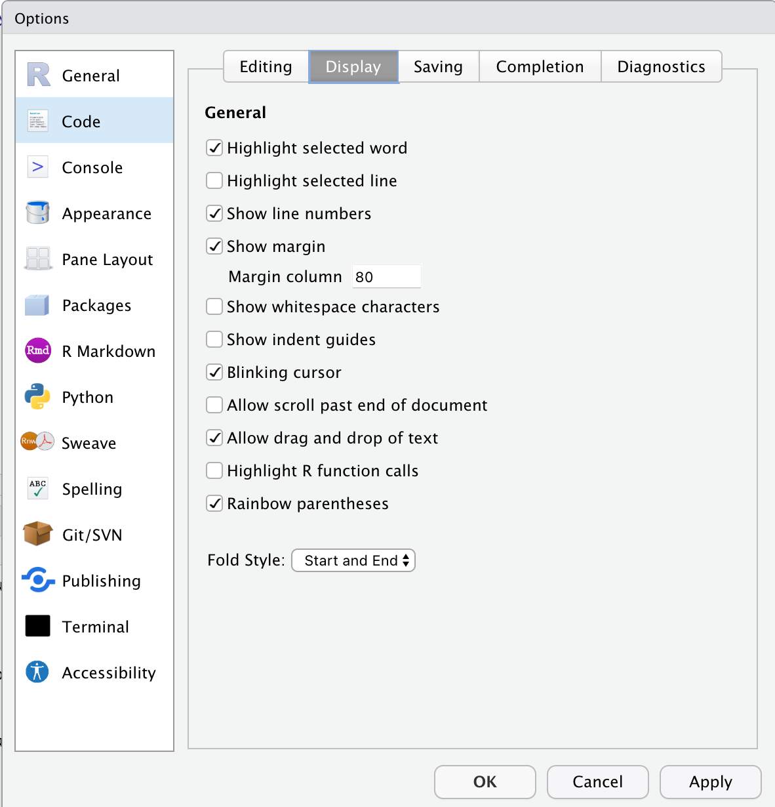
```
]


---
# Apariencia del entorno de RStudio

.pull-left[<br><br><br>
Podemos elegir la mejor combinación de colores para mejorar el contraste.

El mejor contraste puede depender de la situación en la que mostremos nuestro código.

]

.pull-right[
```{r,echo=FALSE,out.width='92%',fig.align='center'}
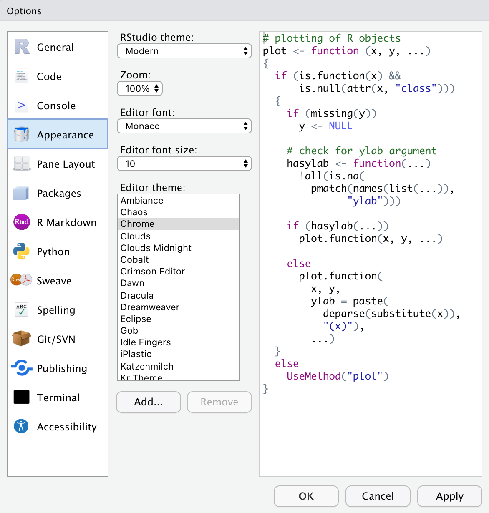
```
]

---
class: chapter-slide

# Algunos atajos del teclado

---
# Atajos para trabajar con scripts
<br>

.pull-left[
- Abrir un nuevo script 
    - Shift + Command + N 
    - Shift + Ctrl + N
    
- Guardar los cambios del script 
    - Command + S 
    - Ctrl + S
]

--
.pull-right[
- Ejecutar el código del script 
    - Command + Enter 
    - Ctrl + Enter

- Escribir el símbolo de asignación 
    - option + - 
]

---
# Todos los atajos disponibles

.pull-left[<br><br><br>
La combinación de teclas depende del sistema operativo de nuestra computadora.

RStudio detecta el sistema que estamos usando y nos muestra la combinación para nuestro caso.

]

.pull-right[
```{r,echo=FALSE,out.width='65%',fig.align='center'}
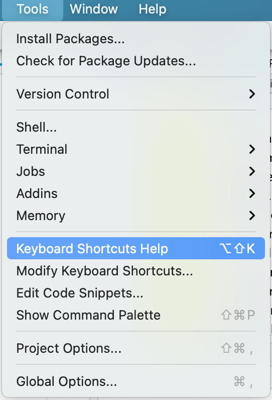
```
]

---
class: chapter-slide
# Mantenimiento de nuestro entorno

---
# Actualizaciones de R y RStudio

.pull-left[
- R desde CRAN

```{r,echo=FALSE,out.width='100%',fig.align='center'}
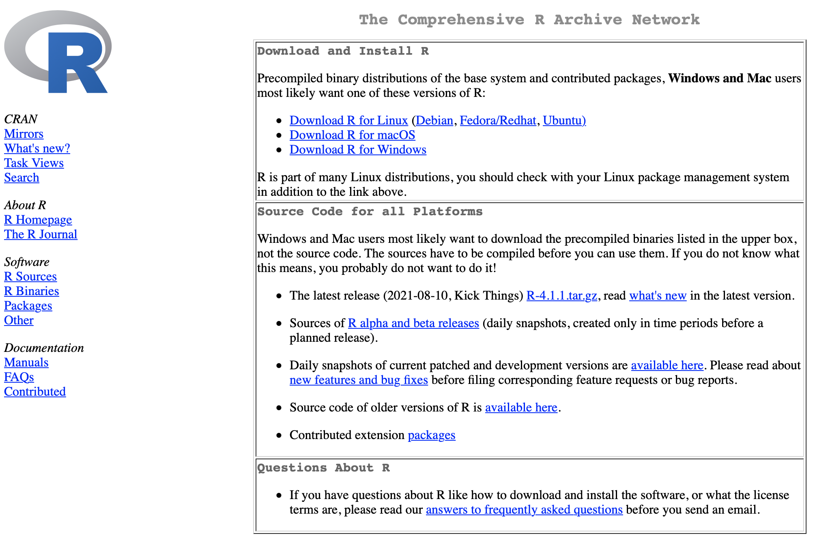
```
.center[<https://cran.r-project.org>]
]

.pull-right[
- RStudio desde la aplicación

```{r,echo=FALSE,out.width='70%',fig.align='center'}
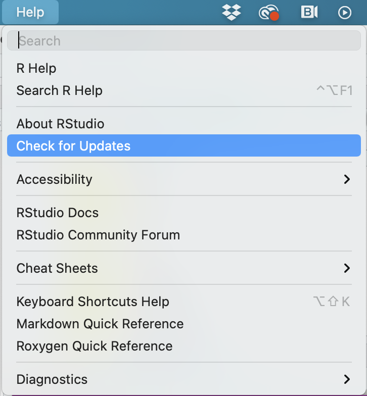
```
]

---
class: chapter-slide

# Primeros pasos en R: Vectores

---
# Definiendo un vector

## Símbolo de asignación

Para definir variables

```{r}
mi_vector <- 10
mi_vector <- "a"
```

--
## Función Combine

```{r}
mi_vector <- c(1,10,25,30)
mi_vector <- c("a","b","c")
```

---
# Propiedades de los vectores

- Tienen una sola dimensión (Sólo tienen longitud)

```{r}
mi_vector <- c(1,2,3,4)
length(mi_vector)
```

--
- Todos los elementos deben ser del mismo tipo
    - Numeric
    - Integer
    - Double
    - Character
    - Factor
    - Logical

---


```{r}
x_num <- c(1, 2, 3)
class(x_num)

x_int <- c(1L, 2L, 3L)
class(x_int)

x_dbl <- c(1, 2.5, 3.1)
typeof(x_dbl)

```

---
```{r}
x_chr <- c("a", "b", "c")
class(x_chr)

x_fct <- factor("a","b","c")
class(x_fct)

x_log <- c(TRUE, FALSE, TRUE)
class(x_log)
```

---

- Si existen diferentes tipos de datos, R encuentra la forma de unificarlos

```{r}
x <- c(1, "a", TRUE)
x

class(x)
```

---
# Extrayendo elementos de los vectores

## Usando la posición

```{r}
x <- c(1,2,3,4,5)
x

# Extraer el número 3
x[3]
```

---
```{r}
x <- c(1,2,3,4,5)
# Extraer del número 3 al 5
x[3:5]
```

--
```{r}
x <- c("a","b","c","d","e")
x[3]
x[3:5]
```
---

## Usando el nombre (names)

```{r}
x <- c(1,3,10)
names(x)
```
--
```{r}
# fresas = 1, manzanas = 3 y mangos = 10
names(x) <- c("fresas", "manzanas", "mangos")
names(x)

x["fresas"]
```

---
# Operaciones con vectores

## Operaciones numéricas

```{r}
x <- c(1,2,3,4,5)
x + 1
```
--
```{r}
y <- c(1,2)
x + y
```

---
```{r}
x <- c(1,2,3,4,5)
x - 1
```
--
```{r}
y <- c(1,2)
x - y
```

---

```{r}
x * 2

x/2

x^3

sqrt(x)
```

---

```{r}
x <- 10

log(x)

log10(x)

log2(x)

logb(x, base = 3)
```

---

# Funciones útiles para crear vectores

```{r}
seq(1:5)
```
--
```{r}
seq(from = 0, to = 10, by = 2)
```
--
```{r}
rnorm(10, mean = 0, sd = 0.5)
```

---

```{r}
letters

letters[1:5]
```
--
    
```{r}
LETTERS

LETTERS[5:10]
```

---
# Usando condicionales

```{r}
x <- 1:5

x[x < 4]

x[x >= 3]
```

---
```{r}
x <- c("a","a","b","c","c","c")

x[x == "a"]
```
--
```{r}
y <- c("b", "c")

x[x %in% y]
```

---

.pull-left[<br><br><br><br><br><br><br>
.center[
# ¡Gracias!
]
]

.pull-right[<br><br><br><br>
```{r,echo=FALSE,out.width='100%',fig.align='center'}
knitr::include_graphics("img/gracias.png")
```

.pull-right[Ilustración de Allison Horst]
]
